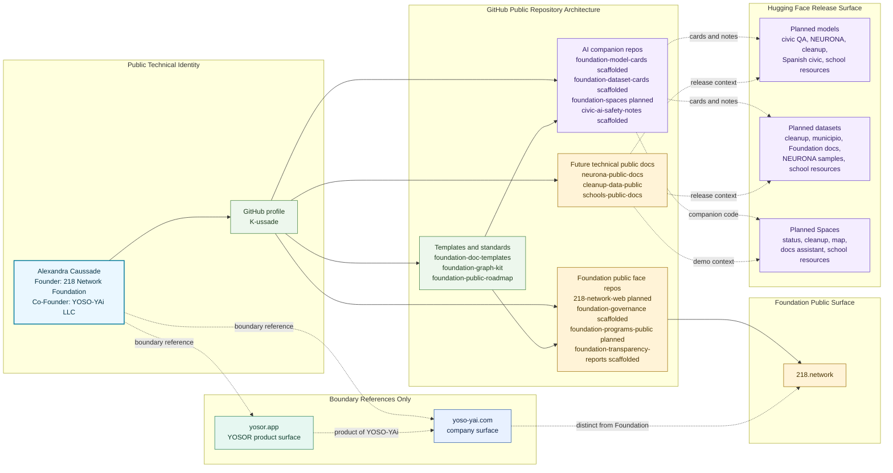
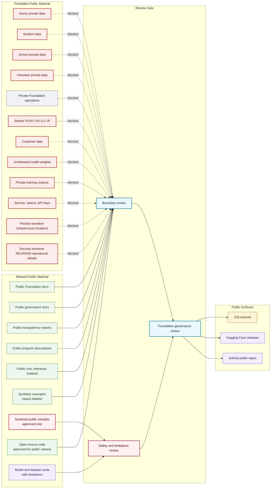

# Public Account Visuals

## Purpose

These Mermaid diagrams make the public account architecture visible without creating placeholder products, fake models, or unreviewed datasets. GitHub renders these diagrams directly in Markdown.

## Account Surface Map

## Public Trust Boundary

## Release Flow Index

| Flow | Source Of Truth |
| --- | --- |
| Model release flow | `repo-blueprint/account-surfaces/graphs/model-release-flow.md` |
| Dataset release flow | `repo-blueprint/account-surfaces/graphs/dataset-release-flow.md` |
| Space demo flow | `repo-blueprint/account-surfaces/graphs/space-demo-flow.md` |
| GitHub to Hugging Face link map | `repo-blueprint/account-surfaces/graphs/github-to-huggingface-link-map.md` |

The public visuals intentionally show planned architecture and review gates. They do not claim that future models, datasets, Spaces, or Foundation program repositories already exist.
