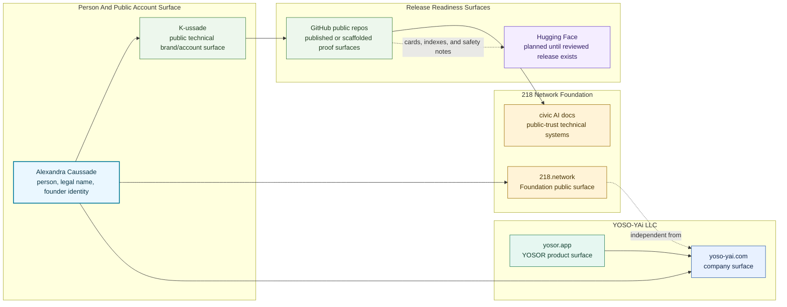
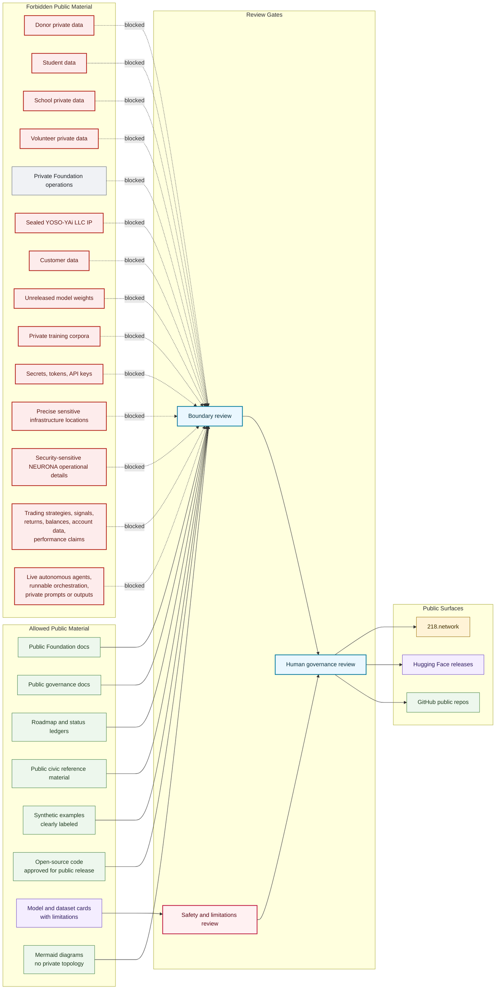

# Public Account Visuals

## Purpose

These Mermaid diagrams make the K-ussade public account architecture visible without creating placeholder products, fake models, fake datasets, live deployment claims, or unreviewed Hugging Face releases.

## Account Surface Map

## Recommended Pin Map

```mermaid
flowchart TB
  profile["K-ussade profile<br/>public technical surface"]:::authority

  subgraph pins["Recommended Six Pins"]
    graphKit["foundation-graph-kit<br/>Mermaid graph standards"]:::public
    roadmap["foundation-public-roadmap<br/>status and release-readiness ledger"]:::public
    safety["civic-ai-safety-notes<br/>safety, limits, claim review"]:::foundation
    modelCards["foundation-model-cards<br/>future model-card readiness"]:::release
    datasetCards["foundation-dataset-cards<br/>future dataset-card readiness"]:::release
    aiOps["autonomous-ai-ops-kit<br/>supervised AI ops governance"]:::workflow
  end

  subgraph secondary["Secondary Proof Surfaces"]
    research["research-agent-workflows<br/>research workflow discipline"]:::workflow
    trading["trading-agent-governance<br/>governance only, no advice"]:::risk
    portfolio["foundation-portfolio-proof<br/>future review-required proof index"]:::public
    templates["foundation-doc-templates<br/>documentation templates"]:::public
  end

  subgraph plannedHf["Planned Hugging Face Artifacts"]
    models["models<br/>planned until reviewed release"]:::release
    datasets["datasets<br/>planned until reviewed release"]:::release
    spaces["Spaces<br/>planned until reviewed release"]:::release
  end

  profile --> graphKit
  profile --> roadmap
  profile --> safety
  profile --> modelCards
  profile --> datasetCards
  profile --> aiOps
  profile -. visible but not first-six pins .-> research
  profile -. visible but not first-six pins .-> trading
  profile -. visible but not first-six pins .-> portfolio
  profile -. visible but not first-six pins .-> templates
  modelCards -. readiness docs only .-> models
  datasetCards -. readiness docs only .-> datasets
  roadmap -. status only .-> spaces

  classDef public fill:#edf7ed,stroke:#3a7d3a,color:#1f3d1f;
  classDef foundation fill:#fff3d7,stroke:#9a6b00,color:#463100;
  classDef release fill:#f4edff,stroke:#6941c6,color:#2f1b63;
  classDef workflow fill:#eaf7ff,stroke:#027a9d,color:#083344;
  classDef risk fill:#fff1f2,stroke:#be123c,stroke-width:2px,color:#5f0715;
  classDef authority fill:#eaf7ff,stroke:#027a9d,stroke-width:2px,color:#083344;
```

## Public Trust Boundary

## Interpretation Notes

- Alexandra Caussade is the person and founder identity; K-ussade is the public technical account surface.
- The six recommended pins show public documentation infrastructure, status discipline, civic AI safety, Hugging Face release readiness, data governance, and supervised AI operations governance.
- Research-agent and trading-agent governance repos remain visible proof surfaces but are secondary to reduce first-view claim risk.
- Planned Hugging Face models, datasets, and Spaces remain planned until reviewed public artifacts exist.

## Boundary Notes

- The 218 Network Foundation is not YOSO-YAi LLC marketing, CSR framing, or product proof.
- Public GitHub repositories are proof surfaces for documentation and governance discipline, not evidence of live deployments or active services.
- Trading-agent governance documentation is not financial advice, not investment advice, not a trading bot, not a trading system, and not a performance claim.
- Private Foundation operations, sealed YOSO-YAi LLC IP, customer data, donor data, student data, volunteer data, private training corpora, secrets, and security-sensitive NEURONA details stay outside public visuals.

## Follow-Up Actions

- Keep GitHub profile pins aligned with `PINNED_REPOS.md`.
- Add Hugging Face links only after public artifacts, cards, release notes, safety notes, companion links, and review status exist.
- Re-audit the first-view pins before any portfolio, Upwork, press, or partner-facing reuse.
